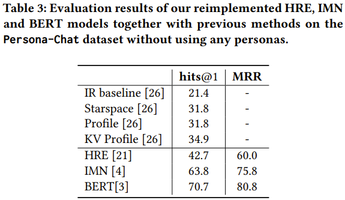
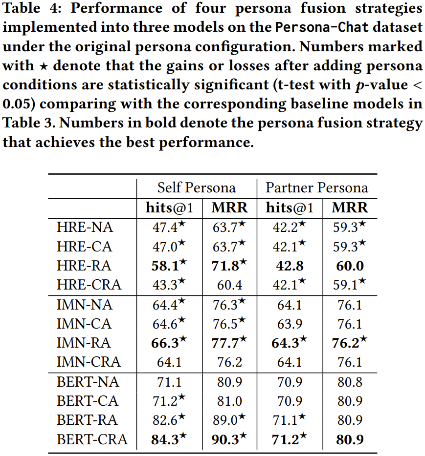
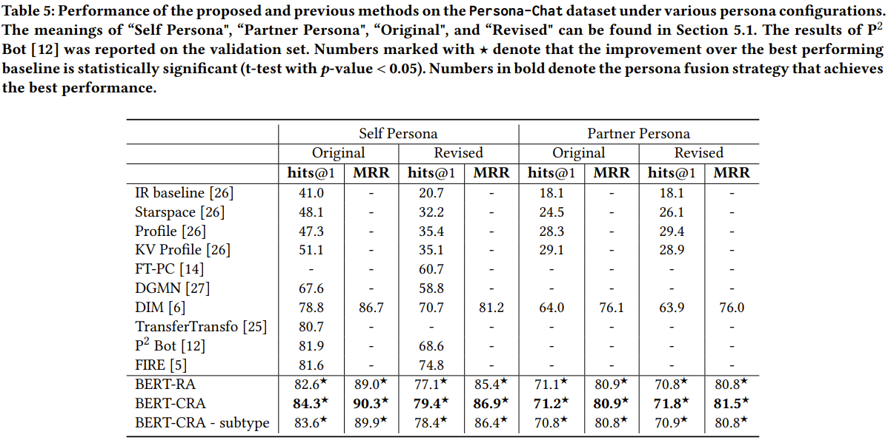

# Partner Matters! An Empirical Study on Fusing Personas for Personalized Response Selection in Retrieval-Based Chatbots
This repository contains the source code for the _SIGIR 2021_ paper **Partner Matters! An Empirical Study on Fusing Personas for Personalized Response Selection in Retrieval-Based Chatbots**. Jia-Chen Gu, Hui Liu, Zhen-Hua Ling, Quan Liu, Zhigang Chen, Xiaodan Zhu.  
Preprint and code will be released soon.  

## Introduction
Persona can function as the prior knowledge for maintaining the consistency of dialogue systems.
Most of previous studies adopted the self persona in dialogue whose response was about to be selected from a set of candidates or directly generated, but few have noticed the role of partner in dialogue.
This paper makes an attempt to thoroughly explore the impact of utilizing personas that describe either self or partner speakers on the task of response selection in retrieval-based chatbots.
Four persona fusion strategies are designed, which assume personas interact with contexts or responses in different ways.
These strategies are implemented into three representative models for response selection, which are based on the Hierarchical Recurrent Encoder (HRE), Interactive Matching Network (IMN) and Bidirectional Encoder Representations from Transformers (BERT) respectively.
Empirical studies on the Persona-Chat dataset show that the partner personas neglected in previous studies can improve the accuracy of response selection in the IMN- and BERT-based models.
Besides, our BERT-based model implemented with the context-response-aware persona fusion strategy outperforms previous methods by margins larger than 2.7% on original personas and 4.6% on revised personas in terms of hits@1 (top-1 accuracy), achieving a new state-of-the-art performance on the Persona-Chat dataset.

## Update
Please keep an eye on this repository if you are interested in our work.
Feel free to contact us (gujc@mail.ustc.edu.cn) or open issues.
