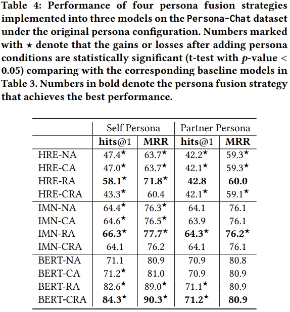

# Partner Matters! An Empirical Study on Fusing Personas for Personalized Response Selection in Retrieval-Based Chatbots
This repository contains the source code for the _SIGIR 2021_ paper [Partner Matters! An Empirical Study on Fusing Personas for Personalized Response Selection in Retrieval-Based Chatbots](https://arxiv.org/pdf/2105.09050.pdf). Jia-Chen Gu, Hui Liu, Zhen-Hua Ling, Quan Liu, Zhigang Chen, Xiaodan Zhu. <br>


## Introduction
Persona can function as the prior knowledge for maintaining the consistency of dialogue systems.
Most of previous studies adopted the self persona in dialogue whose response was about to be selected from a set of candidates or directly generated, but few have noticed the role of partner in dialogue.
This paper makes an attempt to thoroughly explore the impact of utilizing personas that describe either self or partner speakers on the task of response selection in retrieval-based chatbots.
Four persona fusion strategies are designed, which assume personas interact with contexts or responses in different ways.
These strategies are implemented into three representative models for response selection, which are based on the Hierarchical Recurrent Encoder (HRE), Interactive Matching Network (IMN) and Bidirectional Encoder Representations from Transformers (BERT) respectively.
Empirical studies on the Persona-Chat dataset show that the partner personas neglected in previous studies can improve the accuracy of response selection in the IMN- and BERT-based models.
Besides, our BERT-based model implemented with the context-response-aware persona fusion strategy outperforms previous methods by margins larger than 2.7% on original personas and 4.6% on revised personas in terms of hits@1 (top-1 accuracy), achieving a new state-of-the-art performance on the Persona-Chat dataset.

<div align=center></div>

<div align=center></div>

<div align=center></div>


## Dependencies
Python 3.6 <br>
Tensorflow 1.13.1


## Download
- Download the [BERT released by the Google research](https://storage.googleapis.com/bert_models/2018_10_18/uncased_L-12_H-768_A-12.zip), 
  and move to path: ./BERT-based/uncased_L-12_H-768_A-12 <br>
- Download the PERSONA-CHAT dataset [here](https://drive.google.com/open?id=1gNyVL5pSMO6DnTIlA9ORNIrd2zm8f3QH) or from [ParlAI](https://parl.ai/), and unzip it to the folder of ```data```. <br>
Run the following commands and the processed files are stored in ```data/personachat_processed/```. <br>
```
cd data
python data_preprocess.py
```


## Training
Take the BERT-CRA model as an example. <br>
Create the fine-tuning data.
```
cd BERT-based/BERT-CRA/
python data_process_tfrecord.py
```
Running the fine-tuning process.
```
cd scripts/
bash train.sh
```


## Testing
Modify the variable ```restore_model_dir``` in ```test.sh```
```
cd scripts/
bash test.sh
```
A "output_test.txt" file which records scores for each context-response pair will be saved to the path of ```restore_model_dir```. <br>
Modify the variable ```test_out_filename``` in ```compute_metrics.py``` and then run the following command, various metrics will be shown.
```
python compute_metrics.py
```


## Cite
If you think our work is helpful or use the code, please cite the following paper:
**"Partner Matters! An Empirical Study on Fusing Personas for Personalized Response Selection in Retrieval-Based Chatbots"**
Jia-Chen Gu, Hui Liu, Zhen-Hua Ling, Quan Liu, Zhigang Chen, Xiaodan Zhu. _SIGIR (2021)_

```
@inproceedings{10.1145/3404835.3462858,
 author = {Gu, Jia-Chen and Liu, Hui and Ling, Zhen-Hua and Liu, Quan and Chen, Zhigang and Zhu, Xiaodan},
 title = {Partner Matters! An Empirical Study on Fusing Personas for Personalized Response Selection in Retrieval-Based Chatbots},
 year = {2021},
 isbn = {9781450380379},
 publisher = {Association for Computing Machinery},
 address = {New York, NY, USA},
 url = {https://doi.org/10.1145/3404835.3462858},
 doi = {10.1145/3404835.3462858},
 booktitle = {Proceedings of the 44th International ACM SIGIR Conference on Research and Development in Information Retrieval},
 pages = {565–574},
 numpages = {10},
 location = {Virtual Event, Canada},
 series = {SIGIR '21}
 }
```


## Update
Please keep an eye on this repository if you are interested in our work.
Feel free to contact us (gujc@mail.ustc.edu.cn) or open issues.
